# native-x-icon

[](https://github.com/semantic-release/semantic-release)

Icon package

## Install

### Yarn

```sh
yarn add native-x-icon
```

### NPM

```sh
npm install native-x-icon
```

## Usage

```tsx
import { HomeOutlineIcon } from 'native-x-icon'

function MyComponent() {
  return (
    <Stack>
      ...
      <HomeOutlineIcon />
      ...
    </Stack>
  )
}
```

## API

| Property              | Default Value   | Usage                                                                                              |
| --------------------- | --------------- | -------------------------------------------------------------------------------------------------- |
| color?: string        | COLOR.SECONDARY | Color of the icon                                                                                  |
| size?: Size or number | 'normal'        | Valid values: 'xx-small', 'x-small', 'small', 'normal', 'large', 'x-large', 'xx-large' or a number |

## List of Icon

| Icon                                                                  | Component                          | Outline                                                                               | Outline Component                         |
| --------------------------------------------------------------------- | ---------------------------------- | ------------------------------------------------------------------------------------- | ----------------------------------------- |
|                            | `<AccessibilityIcon />`            | 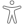                           | `<AccessibilityOutlineIcon />`            |
|                                  | `<AddCircleIcon />`                |                                  | `<AddCircleOutlineIcon />`                |
|                                                | `<AddIcon />`                      |                                                | `<AddOutlineIcon />`                      |
|                                      | `<AirplaneIcon />`                 |                                      | `<AirplaneOutlineIcon />`                 |
|                                            | `<AlarmIcon />`                    |                                            | `<AlarmOutlineIcon />`                    |
|                                          | `<AlbumsIcon />`                   |                                          | `<AlbumsOutlineIcon />`                   |
|                              | `<AlertCircleIcon />`              |                              | `<AlertCircleOutlineIcon />`              |
|                                            | `<AlertIcon />`                    |                                            | `<AlertOutlineIcon />`                    |
|                    | `<AmericanFootballIcon />`         |                    | `<AmericanFootballOutlineIcon />`         |
|                                    | `<AnalyticsIcon />`                |                                    | `<AnalyticsOutlineIcon />`                |
|                                      | `<ApertureIcon />`                 |                                      | `<ApertureOutlineIcon />`                 |
|                                              | `<AppsIcon />`                     | 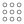                                             | `<AppsOutlineIcon />`                     |
|                                        | `<ArchiveIcon />`                  |                                        | `<ArchiveOutlineIcon />`                  |
|                    | `<ArrowBackCircleIcon />`          |                    | `<ArrowBackCircleOutlineIcon />`          |
|                                  | `<ArrowBackIcon />`                |                                  | `<ArrowBackOutlineIcon />`                |
|                    | `<ArrowDownCircleIcon />`          |                    | `<ArrowDownCircleOutlineIcon />`          |
|                                  | `<ArrowDownIcon />`                |                                  | `<ArrowDownOutlineIcon />`                |
|              | `<ArrowForwardCircleIcon />`       |              | `<ArrowForwardCircleOutlineIcon />`       |
|                            | `<ArrowForwardIcon />`             |                            | `<ArrowForwardOutlineIcon />`             |
|                    | `<ArrowRedoCircleIcon />`          |                    | `<ArrowRedoCircleOutlineIcon />`          |
|                                  | `<ArrowRedoIcon />`                |                                  | `<ArrowRedoOutlineIcon />`                |
|                    | `<ArrowUndoCircleIcon />`          |                    | `<ArrowUndoCircleOutlineIcon />`          |
|                                  | `<ArrowUndoIcon />`                |                                  | `<ArrowUndoOutlineIcon />`                |
|                        | `<ArrowUpCircleIcon />`            |                        | `<ArrowUpCircleOutlineIcon />`            |
|                                      | `<ArrowUpIcon />`                  |                                      | `<ArrowUpOutlineIcon />`                  |
|                                    | `<AtCircleIcon />`                 |                                    | `<AtCircleOutlineIcon />`                 |
|                                          | `<AttachIcon />`                   |                                          | `<AttachOutlineIcon />`                   |
|                                    | `<BackspaceIcon />`                |                                    | `<BackspaceOutlineIcon />`                |
|                                        | `<BagAddIcon />`                   |                                        | `<BagAddOutlineIcon />`                   |
|                                    | `<BagCheckIcon />`                 |                                    | `<BagCheckOutlineIcon />`                 |
|                                  | `<BagHandleIcon />`                |                                  | `<BagHandleOutlineIcon />`                |
|                                                | `<BagIcon />`                      |                                                | `<BagOutlineIcon />`                      |
|                                  | `<BagRemoveIcon />`                |                                  | `<BagRemoveOutlineIcon />`                |
|                                                | `<BanIcon />`                      |                                                | `<BanOutlineIcon />`                      |
|                                        | `<BandageIcon />`                  |                                        | `<BandageOutlineIcon />`                  |
|                                    | `<BarChartIcon />`                 |                                    | `<BarChartOutlineIcon />`                 |
|                                        | `<BarbellIcon />`                  |                                        | `<BarbellOutlineIcon />`                  |
|                                        | `<BarcodeIcon />`                  |                                        | `<BarcodeOutlineIcon />`                  |
|                                      | `<BaseballIcon />`                 |                                      | `<BaseballOutlineIcon />`                 |
|                                          | `<BasketIcon />`                   |                                          | `<BasketOutlineIcon />`                   |
|                                  | `<BasketballIcon />`               |                                  | `<BasketballOutlineIcon />`               |
|                      | `<BatteryChargingIcon />`          |                      | `<BatteryChargingOutlineIcon />`          |
|                              | `<BatteryDeadIcon />`              |                              | `<BatteryDeadOutlineIcon />`              |
|                              | `<BatteryFullIcon />`              |                              | `<BatteryFullOutlineIcon />`              |
|                              | `<BatteryHalfIcon />`              |                              | `<BatteryHalfOutlineIcon />`              |
|                                          | `<BeakerIcon />`                   |                                          | `<BeakerOutlineIcon />`                   |
|                                                | `<BedIcon />`                      |                                                | `<BedOutlineIcon />`                      |
|                                              | `<BeerIcon />`                     |                                              | `<BeerOutlineIcon />`                     |
|                                        | `<BicycleIcon />`                  |                                        | `<BicycleOutlineIcon />`                  |
|                                    | `<BluetoothIcon />`                |                                    | `<BluetoothOutlineIcon />`                |
| 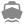                                             | `<BoatIcon />`                     |                                              | `<BoatOutlineIcon />`                     |
| 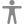                                             | `<BodyIcon />`                     | 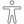                                             | `<BodyOutlineIcon />`                     |
|                                        | `<BonfireIcon />`                  |                                        | `<BonfireOutlineIcon />`                  |
|                                              | `<BookIcon />`                     |                                              | `<BookOutlineIcon />`                     |
|                                      | `<BookmarkIcon />`                 |                                      | `<BookmarkOutlineIcon />`                 |
|                                    | `<BookmarksIcon />`                |                                    | `<BookmarksOutlineIcon />`                |
|                                    | `<BriefcaseIcon />`                |                                    | `<BriefcaseOutlineIcon />`                |
|                                      | `<BrowsersIcon />`                 |                                      | `<BrowsersOutlineIcon />`                 |
|                                            | `<BrushIcon />`                    |                                            | `<BrushOutlineIcon />`                    |
|                                                | `<BugIcon />`                      |                                                | `<BugOutlineIcon />`                      |
|                                            | `<BuildIcon />`                    |                                            | `<BuildOutlineIcon />`                    |
|                                              | `<BulbIcon />`                     |                                              | `<BulbOutlineIcon />`                     |
|                                                | `<BusIcon />`                      |                                                | `<BusOutlineIcon />`                      |
|                                      | `<BusinessIcon />`                 |                                      | `<BusinessOutlineIcon />`                 |
|                                              | `<CafeIcon />`                     |                                              | `<CafeOutlineIcon />`                     |
|                                  | `<CalculatorIcon />`               |                                  | `<CalculatorOutlineIcon />`               |
|                          | `<CalendarClearIcon />`            |                          | `<CalendarClearOutlineIcon />`            |
|                                      | `<CalendarIcon />`                 |                                      | `<CalendarOutlineIcon />`                 |
|                                              | `<CallIcon />`                     |                                              | `<CallOutlineIcon />`                     |
|                                          | `<CameraIcon />`                   |                                          | `<CameraOutlineIcon />`                   |
|                          | `<CameraReverseIcon />`            |                          | `<CameraReverseOutlineIcon />`            |
|                                                | `<CarIcon />`                      |                                                | `<CarOutlineIcon />`                      |
|                                    | `<CarSportIcon />`                 |                                    | `<CarSportOutlineIcon />`                 |
|                                              | `<CardIcon />`                     |                                              | `<CardOutlineIcon />`                     |
|                    | `<CaretBackCircleIcon />`          |                    | `<CaretBackCircleOutlineIcon />`          |
|                                  | `<CaretBackIcon />`                |                                  | `<CaretBackOutlineIcon />`                |
|                    | `<CaretDownCircleIcon />`          |                    | `<CaretDownCircleOutlineIcon />`          |
|                                  | `<CaretDownIcon />`                |                                  | `<CaretDownOutlineIcon />`                |
|              | `<CaretForwardCircleIcon />`       |              | `<CaretForwardCircleOutlineIcon />`       |
|                            | `<CaretForwardIcon />`             |                            | `<CaretForwardOutlineIcon />`             |
|                        | `<CaretUpCircleIcon />`            |                        | `<CaretUpCircleOutlineIcon />`            |
|                                      | `<CaretUpIcon />`                  |                                      | `<CaretUpOutlineIcon />`                  |
|                                              | `<CartIcon />`                     |                                              | `<CartOutlineIcon />`                     |
|                                              | `<CashIcon />`                     |                                              | `<CashOutlineIcon />`                     |
|                                      | `<CellularIcon />`                 | 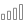                                     | `<CellularOutlineIcon />`                 |
|                      | `<ChatboxEllipsesIcon />`          |                      | `<ChatboxEllipsesOutlineIcon />`          |
|                                        | `<ChatboxIcon />`                  |                                        | `<ChatboxOutlineIcon />`                  |
|                | `<ChatbubbleEllipsesIcon />`       |                | `<ChatbubbleEllipsesOutlineIcon />`       |
|                                  | `<ChatbubbleIcon />`               |                                  | `<ChatbubbleOutlineIcon />`               |
|                                | `<ChatbubblesIcon />`              |                                | `<ChatbubblesOutlineIcon />`              |
|                                      | `<CheckboxIcon />`                 |                                      | `<CheckboxOutlineIcon />`                 |
|                      | `<CheckmarkCircleIcon />`          |                      | `<CheckmarkCircleOutlineIcon />`          |
|            | `<CheckmarkDoneCircleIcon />`      |            | `<CheckmarkDoneCircleOutlineIcon />`      |
|                          | `<CheckmarkDoneIcon />`            |                          | `<CheckmarkDoneOutlineIcon />`            |
|                                    | `<CheckmarkIcon />`                |                                    | `<CheckmarkOutlineIcon />`                |
|                | `<ChevronBackCircleIcon />`        |                | `<ChevronBackCircleOutlineIcon />`        |
|                              | `<ChevronBackIcon />`              |                              | `<ChevronBackOutlineIcon />`              |
|                | `<ChevronDownCircleIcon />`        |                | `<ChevronDownCircleOutlineIcon />`        |
|                              | `<ChevronDownIcon />`              |                              | `<ChevronDownOutlineIcon />`              |
|          | `<ChevronForwardCircleIcon />`     |          | `<ChevronForwardCircleOutlineIcon />`     |
|                        | `<ChevronForwardIcon />`           |                        | `<ChevronForwardOutlineIcon />`           |
|                    | `<ChevronUpCircleIcon />`          |                    | `<ChevronUpCircleOutlineIcon />`          |
|                                  | `<ChevronUpIcon />`                |                                  | `<ChevronUpOutlineIcon />`                |
|                                    | `<ClipboardIcon />`                |                                    | `<ClipboardOutlineIcon />`                |
|                              | `<CloseCircleIcon />`              |                              | `<CloseCircleOutlineIcon />`              |
|                                            | `<CloseIcon />`                    |                                            | `<CloseOutlineIcon />`                    |
|                              | `<CloudCircleIcon />`              |                              | `<CloudCircleOutlineIcon />`              |
|                                  | `<CloudDoneIcon />`                |                                  | `<CloudDoneOutlineIcon />`                |
|                          | `<CloudDownloadIcon />`            |                          | `<CloudDownloadOutlineIcon />`            |
|                                            | `<CloudIcon />`                    |                                            | `<CloudOutlineIcon />`                    |
|                            | `<CloudOfflineIcon />`             |                            | `<CloudOfflineOutlineIcon />`             |
|                              | `<CloudUploadIcon />`              |                              | `<CloudUploadOutlineIcon />`              |
|                                          | `<CloudyIcon />`                   |                                          | `<CloudyOutlineIcon />`                   |
|                              | `<CloudyNightIcon />`              |                              | `<CloudyNightOutlineIcon />`              |
|                            | `<CodeDownloadIcon />`             |                            | `<CodeDownloadOutlineIcon />`             |
|                                              | `<CodeIcon />`                     |                                              | `<CodeOutlineIcon />`                     |
|                                  | `<CodeSlashIcon />`                |                                  | `<CodeSlashOutlineIcon />`                |
|                              | `<CodeWorkingIcon />`              |                              | `<CodeWorkingOutlineIcon />`              |
|                                                | `<CogIcon />`                      |                                                | `<CogOutlineIcon />`                      |
|                                  | `<ColorFillIcon />`                |                                  | `<ColorFillOutlineIcon />`                |
|                              | `<ColorFilterIcon />`              |                              | `<ColorFilterOutlineIcon />`              |
|                            | `<ColorPaletteIcon />`             |                            | `<ColorPaletteOutlineIcon />`             |
|                                  | `<ColorWandIcon />`                |                                  | `<ColorWandOutlineIcon />`                |
|                                        | `<CompassIcon />`                  |                                        | `<CompassOutlineIcon />`                  |
|                                    | `<ConstructIcon />`                |                                    | `<ConstructOutlineIcon />`                |
|                                      | `<ContractIcon />`                 |                                      | `<ContractOutlineIcon />`                 |
|                                      | `<ContrastIcon />`                 |                                      | `<ContrastOutlineIcon />`                 |
|                                              | `<CopyIcon />`                     |                                              | `<CopyOutlineIcon />`                     |
|                                          | `<CreateIcon />`                   |                                          | `<CreateOutlineIcon />`                   |
|                                              | `<CropIcon />`                     |                                              | `<CropOutlineIcon />`                     |
|                                              | `<CubeIcon />`                     |                                              | `<CubeOutlineIcon />`                     |
|                                                | `<CutIcon />`                      |                                                | `<CutOutlineIcon />`                      |
|                                        | `<DesktopIcon />`                  |                                        | `<DesktopOutlineIcon />`                  |
|                                              | `<DiceIcon />`                     |                                              | `<DiceOutlineIcon />`                     |
|                                              | `<DiscIcon />`                     |                                              | `<DiscOutlineIcon />`                     |
|                        | `<DocumentAttachIcon />`           |                        | `<DocumentAttachOutlineIcon />`           |
|                                      | `<DocumentIcon />`                 |                                      | `<DocumentOutlineIcon />`                 |
|                            | `<DocumentLockIcon />`             |                            | `<DocumentLockOutlineIcon />`             |
|                            | `<DocumentTextIcon />`             |                            | `<DocumentTextOutlineIcon />`             |
|                                    | `<DocumentsIcon />`                |                                    | `<DocumentsOutlineIcon />`                |
|                                      | `<DownloadIcon />`                 |                                      | `<DownloadOutlineIcon />`                 |
|                                    | `<DuplicateIcon />`                |                                    | `<DuplicateOutlineIcon />`                |
|                                                | `<EarIcon />`                      |                                                | `<EarOutlineIcon />`                      |
|                                            | `<EarthIcon />`                    |                                            | `<EarthOutlineIcon />`                    |
|                                            | `<EaselIcon />`                    |                                            | `<EaselOutlineIcon />`                    |
|                                                | `<EggIcon />`                      |                                                | `<EggOutlineIcon />`                      |
|                                        | `<EllipseIcon />`                  |                                        | `<EllipseOutlineIcon />`                  |
|  | `<EllipsisHorizontalCircleIcon />` |  | `<EllipsisHorizontalCircleOutlineIcon />` |
|                | `<EllipsisHorizontalIcon />`       |                | `<EllipsisHorizontalOutlineIcon />`       |
|      | `<EllipsisVerticalCircleIcon />`   |      | `<EllipsisVerticalCircleOutlineIcon />`   |
|                    | `<EllipsisVerticalIcon />`         |                    | `<EllipsisVerticalOutlineIcon />`         |
|                                            | `<EnterIcon />`                    |                                            | `<EnterOutlineIcon />`                    |
|                                              | `<ExitIcon />`                     |                                              | `<ExitOutlineIcon />`                     |
|                                          | `<ExpandIcon />`                   |                                          | `<ExpandOutlineIcon />`                   |
|                      | `<ExtensionPuzzleIcon />`          |                      | `<ExtensionPuzzleOutlineIcon />`          |
|                                                | `<EyeIcon />`                      |                                                | `<EyeOutlineIcon />`                      |
|                                        | `<EyeOffIcon />`                   |                                        | `<EyeOffOutlineIcon />`                   |
|                                        | `<EyedropIcon />`                  |                                        | `<EyedropOutlineIcon />`                  |
|                                    | `<FastFoodIcon />`                 |                                    | `<FastFoodOutlineIcon />`                 |
|                                          | `<FemaleIcon />`                   |                                          | `<FemaleOutlineIcon />`                   |
|                          | `<FileTrayFullIcon />`             |                          | `<FileTrayFullOutlineIcon />`             |
|                                    | `<FileTrayIcon />`                 |                                    | `<FileTrayOutlineIcon />`                 |
|                    | `<FileTrayStackedIcon />`          |                    | `<FileTrayStackedOutlineIcon />`          |
|                                              | `<FilmIcon />`                     |                                              | `<FilmOutlineIcon />`                     |
|                            | `<FilterCircleIcon />`             |                            | `<FilterCircleOutlineIcon />`             |
|                                          | `<FilterIcon />`                   |                                          | `<FilterOutlineIcon />`                   |
| 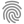                             | `<FingerPrintIcon />`              | 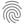                             | `<FingerPrintOutlineIcon />`              |
|                                              | `<FishIcon />`                     |                                              | `<FishOutlineIcon />`                     |
|                                        | `<FitnessIcon />`                  |                                        | `<FitnessOutlineIcon />`                  |
|                                              | `<FlagIcon />`                     |                                              | `<FlagOutlineIcon />`                     |
|                                            | `<FlameIcon />`                    |                                            | `<FlameOutlineIcon />`                    |
|                                            | `<FlashIcon />`                    |                                            | `<FlashOutlineIcon />`                    |
|                                    | `<FlashOffIcon />`                 |                                    | `<FlashOffOutlineIcon />`                 |
|                                  | `<FlashlightIcon />`               |                                  | `<FlashlightOutlineIcon />`               |
|                                            | `<FlaskIcon />`                    |                                            | `<FlaskOutlineIcon />`                    |
|                                          | `<FlowerIcon />`                   |                                          | `<FlowerOutlineIcon />`                   |
|                                          | `<FolderIcon />`                   |                                          | `<FolderOutlineIcon />`                   |
|                                | `<FolderOpenIcon />`               |                                | `<FolderOpenOutlineIcon />`               |
|                                      | `<FootballIcon />`                 |                                      | `<FootballOutlineIcon />`                 |
|                                          | `<FunnelIcon />`                   |                                          | `<FunnelOutlineIcon />`                   |
|                        | `<GameControllerIcon />`           |                        | `<GameControllerOutlineIcon />`           |
|                                              | `<GiftIcon />`                     |                                              | `<GiftOutlineIcon />`                     |
|                                  | `<GitBranchIcon />`                | 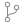                                 | `<GitBranchOutlineIcon />`                |
|                                  | `<GitCommitIcon />`                |                                  | `<GitCommitOutlineIcon />`                |
|                                | `<GitCompareIcon />`               |                                | `<GitCompareOutlineIcon />`               |
|                                    | `<GitMergeIcon />`                 |                                    | `<GitMergeOutlineIcon />`                 |
|                                | `<GitNetworkIcon />`               | 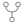                               | `<GitNetworkOutlineIcon />`               |
|                      | `<GitPullRequestIcon />`           | 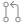                     | `<GitPullRequestOutlineIcon />`           |
|                                        | `<GlassesIcon />`                  |                                        | `<GlassesOutlineIcon />`                  |
|                                            | `<GlobeIcon />`                    |                                            | `<GlobeOutlineIcon />`                    |
|                                              | `<GolfIcon />`                     |                                              | `<GolfOutlineIcon />`                     |
|                                              | `<GridIcon />`                     |                                              | `<GridOutlineIcon />`                     |
|                                          | `<HammerIcon />`                   |                                          | `<HammerOutlineIcon />`                   |
|                                    | `<HandLeftIcon />`                 |                                    | `<HandLeftOutlineIcon />`                 |
|                                  | `<HandRightIcon />`                |                                  | `<HandRightOutlineIcon />`                |
|                                            | `<HappyIcon />`                    |                                            | `<HappyOutlineIcon />`                    |
|                            | `<HardwareChipIcon />`             |                            | `<HardwareChipOutlineIcon />`             |
|                                        | `<HeadsetIcon />`                  |                                        | `<HeadsetOutlineIcon />`                  |
|                              | `<HeartCircleIcon />`              |                              | `<HeartCircleOutlineIcon />`              |
|              | `<HeartDislikeCircleIcon />`       |              | `<HeartDislikeCircleOutlineIcon />`       |
|                            | `<HeartDislikeIcon />`             |                            | `<HeartDislikeOutlineIcon />`             |
|                                  | `<HeartHalfIcon />`                |                                  | `<HeartHalfOutlineIcon />`                |
|                                            | `<HeartIcon />`                    |                                            | `<HeartOutlineIcon />`                    |
|                                    | `<HelpBuoyIcon />`                 |                                    | `<HelpBuoyOutlineIcon />`                 |
|                                | `<HelpCircleIcon />`               |                                | `<HelpCircleOutlineIcon />`               |
|                                              | `<HelpIcon />`                     |                                              | `<HelpOutlineIcon />`                     |
|                                              | `<HomeIcon />`                     |                                              | `<HomeOutlineIcon />`                     |
|                                    | `<HourglassIcon />`                |                                    | `<HourglassOutlineIcon />`                |
|                                    | `<IceCreamIcon />`                 |                                    | `<IceCreamOutlineIcon />`                 |
|                                            | `<ImageIcon />`                    |                                            | `<ImageOutlineIcon />`                    |
|                                          | `<ImagesIcon />`                   |                                          | `<ImagesOutlineIcon />`                   |
|                                      | `<InfiniteIcon />`                 |                                      | `<InfiniteOutlineIcon />`                 |
|                  | `<InformationCircleIcon />`        |                  | `<InformationCircleOutlineIcon />`        |
|                                | `<InformationIcon />`              |                                | `<InformationOutlineIcon />`              |
|                                | `<InvertModeIcon />`               |                                | `<InvertModeOutlineIcon />`               |
|                                        | `<JournalIcon />`                  |                                        | `<JournalOutlineIcon />`                  |
|                                                | `<KeyIcon />`                      |                                                | `<KeyOutlineIcon />`                      |
|                                          | `<KeypadIcon />`                   |                                          | `<KeypadOutlineIcon />`                   |
|                                      | `<LanguageIcon />`                 |                                      | `<LanguageOutlineIcon />`                 |
|                                          | `<LaptopIcon />`                   |                                          | `<LaptopOutlineIcon />`                   |
|                                          | `<LayersIcon />`                   |                                          | `<LayersOutlineIcon />`                   |
|                                              | `<LeafIcon />`                     |                                              | `<LeafOutlineIcon />`                     |
|                                        | `<LibraryIcon />`                  |                                        | `<LibraryOutlineIcon />`                  |
|                                              | `<LinkIcon />`                     |                                              | `<LinkOutlineIcon />`                     |
|                                | `<ListCircleIcon />`               |                                | `<ListCircleOutlineIcon />`               |
|                                              | `<ListIcon />`                     |                                              | `<ListOutlineIcon />`                     |
|                                          | `<LocateIcon />`                   |                                          | `<LocateOutlineIcon />`                   |
|                                      | `<LocationIcon />`                 |                                      | `<LocationOutlineIcon />`                 |
|                                | `<LockClosedIcon />`               |                                | `<LockClosedOutlineIcon />`               |
|                                    | `<LockOpenIcon />`                 |                                    | `<LockOpenOutlineIcon />`                 |
|                                          | `<LogInIcon />`                    |                                          | `<LogInOutlineIcon />`                    |
|                                        | `<LogOutIcon />`                   |                                        | `<LogOutOutlineIcon />`                   |
|                                          | `<MagnetIcon />`                   |                                          | `<MagnetOutlineIcon />`                   |
|                                              | `<MailIcon />`                     |                                              | `<MailOutlineIcon />`                     |
|                                    | `<MailOpenIcon />`                 |                                    | `<MailOpenOutlineIcon />`                 |
|                                | `<MailUnreadIcon />`               |                                | `<MailUnreadOutlineIcon />`               |
|                                | `<MaleFemaleIcon />`               |                                | `<MaleFemaleOutlineIcon />`               |
|                                              | `<MaleIcon />`                     |                                              | `<MaleOutlineIcon />`                     |
|                                                | `<ManIcon />`                      |                                                | `<ManOutlineIcon />`                      |
|                                                | `<MapIcon />`                      |                                                | `<MapOutlineIcon />`                      |
|                                            | `<MedalIcon />`                    |                                            | `<MedalOutlineIcon />`                    |
|                                        | `<MedicalIcon />`                  |                                        | `<MedicalOutlineIcon />`                  |
|                                          | `<MedkitIcon />`                   |                                          | `<MedkitOutlineIcon />`                   |
|                                    | `<MegaphoneIcon />`                |                                    | `<MegaphoneOutlineIcon />`                |
|                                              | `<MenuIcon />`                     |                                              | `<MenuOutlineIcon />`                     |
|                                  | `<MicCircleIcon />`                |                                  | `<MicCircleOutlineIcon />`                |
|                                                | `<MicIcon />`                      |                                                | `<MicOutlineIcon />`                      |
|                          | `<MicOffCircleIcon />`             |                          | `<MicOffCircleOutlineIcon />`             |
|                                        | `<MicOffIcon />`                   |                                        | `<MicOffOutlineIcon />`                   |
|                                              | `<MoonIcon />`                     |                                              | `<MoonOutlineIcon />`                     |
|                                              | `<MoveIcon />`                     |                                              | `<MoveOutlineIcon />`                     |
|                              | `<MusicalNoteIcon />`              |                              | `<MusicalNoteOutlineIcon />`              |
|                            | `<MusicalNotesIcon />`             |                            | `<MusicalNotesOutlineIcon />`             |
|                        | `<NavigateCircleIcon />`           |                        | `<NavigateCircleOutlineIcon />`           |
|                                      | `<NavigateIcon />`                 |                                      | `<NavigateOutlineIcon />`                 |
|                                    | `<NewspaperIcon />`                |                                    | `<NewspaperOutlineIcon />`                |
|              | `<NotificationsCircleIcon />`      |              | `<NotificationsCircleOutlineIcon />`      |
|                            | `<NotificationsIcon />`            |                            | `<NotificationsOutlineIcon />`            |
[notifications-with-badge](./icons/notification-outline-with-badge.svg)                           | `<NotificationsWithBadgeIcon />`            |
[notifications-outline-with-badge](./icons/notification-outline-with-badge.svg)                           | `<NotificationsOutlineWithBadgeIcon />`            |
|      | `<NotificationsOffCircleIcon />`   |      | `<NotificationsOffCircleOutlineIcon />`   |
|                    | `<NotificationsOffIcon />`         |                    | `<NotificationsOffOutlineIcon />`         |
|                                        | `<NuclearIcon />`                  |                                        | `<NuclearOutlineIcon />`                  |
|                                    | `<NutritionIcon />`                |                                    | `<NutritionOutlineIcon />`                |
|                                              | `<OpenIcon />`                     |                                              | `<OpenOutlineIcon />`                     |
|                                        | `<OptionsIcon />`                  |                                        | `<OptionsOutlineIcon />`                  |
|                                | `<PaperPlaneIcon />`               |                                | `<PaperPlaneOutlineIcon />`               |
|                              | `<PartlySunnyIcon />`              |                              | `<PartlySunnyOutlineIcon />`              |
|                              | `<PauseCircleIcon />`              |                              | `<PauseCircleOutlineIcon />`              |
|                                            | `<PauseIcon />`                    |                                            | `<PauseOutlineIcon />`                    |
|                                                | `<PawIcon />`                      |                                                | `<PawOutlineIcon />`                      |
|                                          | `<PencilIcon />`                   |                                          | `<PencilOutlineIcon />`                   |
|                            | `<PeopleCircleIcon />`             |                            | `<PeopleCircleOutlineIcon />`             |
|                                          | `<PeopleIcon />`                   |                                          | `<PeopleOutlineIcon />`                   |
|                                  | `<PersonAddIcon />`                |                                  | `<PersonAddOutlineIcon />`                |
|                            | `<PersonCircleIcon />`             |                            | `<PersonCircleOutlineIcon />`             |
|                                          | `<PersonIcon />`                   |                                          | `<PersonOutlineIcon />`                   |
|                            | `<PersonRemoveIcon />`             |                            | `<PersonRemoveOutlineIcon />`             |
|                        | `<PhoneLandscapeIcon />`           |                        | `<PhoneLandscapeOutlineIcon />`           |
|                          | `<PhonePortraitIcon />`            |                          | `<PhonePortraitOutlineIcon />`            |
|                                    | `<PieChartIcon />`                 |                                    | `<PieChartOutlineIcon />`                 |
|                                                | `<PinIcon />`                      |                                                | `<PinOutlineIcon />`                      |
|                                              | `<PintIcon />`                     |                                              | `<PintOutlineIcon />`                     |
|                                            | `<PizzaIcon />`                    |                                            | `<PizzaOutlineIcon />`                    |
|                                          | `<PlanetIcon />`                   |                                          | `<PlanetOutlineIcon />`                   |
|                      | `<PlayBackCircleIcon />`           |                      | `<PlayBackCircleOutlineIcon />`           |
|                                    | `<PlayBackIcon />`                 |                                    | `<PlayBackOutlineIcon />`                 |
|                                | `<PlayCircleIcon />`               |                                | `<PlayCircleOutlineIcon />`               |
|                | `<PlayForwardCircleIcon />`        |                | `<PlayForwardCircleOutlineIcon />`        |
|                              | `<PlayForwardIcon />`              |                              | `<PlayForwardOutlineIcon />`              |
|                                              | `<PlayIcon />`                     |                                              | `<PlayOutlineIcon />`                     |
|            | `<PlaySkipBackCircleIcon />`       |            | `<PlaySkipBackCircleOutlineIcon />`       |
|                          | `<PlaySkipBackIcon />`             |                          | `<PlaySkipBackOutlineIcon />`             |
|      | `<PlaySkipForwardCircleIcon />`    |      | `<PlaySkipForwardCircleOutlineIcon />`    |
|                    | `<PlaySkipForwardIcon />`          |                    | `<PlaySkipForwardOutlineIcon />`          |
|                                          | `<PodiumIcon />`                   |                                          | `<PodiumOutlineIcon />`                   |
|                                            | `<PowerIcon />`                    |                                            | `<PowerOutlineIcon />`                    |
|                                      | `<PricetagIcon />`                 |                                      | `<PricetagOutlineIcon />`                 |
|                                    | `<PricetagsIcon />`                |                                    | `<PricetagsOutlineIcon />`                |
|                                            | `<PrintIcon />`                    |                                            | `<PrintOutlineIcon />`                    |
|                                            | `<PulseIcon />`                    |                                            | `<PulseOutlineIcon />`                    |
|                                              | `<PushIcon />`                     |                                              | `<PushOutlineIcon />`                     |
|                                        | `<QrCodeIcon />`                   | 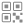                                       | `<QrCodeOutlineIcon />`                   |
|                      | `<RadioButtonOffIcon />`           |                      | `<RadioButtonOffOutlineIcon />`           |
|                        | `<RadioButtonOnIcon />`            |                        | `<RadioButtonOnOutlineIcon />`            |
|                                            | `<RadioIcon />`                    |                                            | `<RadioOutlineIcon />`                    |
|                                            | `<RainyIcon />`                    |                                            | `<RainyOutlineIcon />`                    |
|                                          | `<ReaderIcon />`                   |                                          | `<ReaderOutlineIcon />`                   |
|                                        | `<ReceiptIcon />`                  |                                        | `<ReceiptOutlineIcon />`                  |
|                                    | `<RecordingIcon />`                |                                    | `<RecordingOutlineIcon />`                |
|                          | `<RefreshCircleIcon />`            |                          | `<RefreshCircleOutlineIcon />`            |
|                                        | `<RefreshIcon />`                  |                                        | `<RefreshOutlineIcon />`                  |
|                            | `<ReloadCircleIcon />`             |                            | `<ReloadCircleOutlineIcon />`             |
|                                          | `<ReloadIcon />`                   |                                          | `<ReloadOutlineIcon />`                   |
|                            | `<RemoveCircleIcon />`             |                            | `<RemoveCircleOutlineIcon />`             |
|                                          | `<RemoveIcon />`                   |                                          | `<RemoveOutlineIcon />`                   |
|                              | `<ReorderFourIcon />`              |                              | `<ReorderFourOutlineIcon />`              |
|                            | `<ReorderThreeIcon />`             |                            | `<ReorderThreeOutlineIcon />`             |
|                                | `<ReorderTwoIcon />`               |                                | `<ReorderTwoOutlineIcon />`               |
|                                          | `<RepeatIcon />`                   |                                          | `<RepeatOutlineIcon />`                   |
|                                          | `<ResizeIcon />`                   |                                          | `<ResizeOutlineIcon />`                   |
|                                  | `<RestaurantIcon />`               |                                  | `<RestaurantOutlineIcon />`               |
|                      | `<ReturnDownBackIcon />`           |                      | `<ReturnDownBackOutlineIcon />`           |
|                | `<ReturnDownForwardIcon />`        |                | `<ReturnDownForwardOutlineIcon />`        |
|                          | `<ReturnUpBackIcon />`             |                          | `<ReturnUpBackOutlineIcon />`             |
|                    | `<ReturnUpForwardIcon />`          |                    | `<ReturnUpForwardOutlineIcon />`          |
|                                          | `<RibbonIcon />`                   |                                          | `<RibbonOutlineIcon />`                   |
|                                          | `<RocketIcon />`                   |                                          | `<RocketOutlineIcon />`                   |
|                                              | `<RoseIcon />`                     |                                              | `<RoseOutlineIcon />`                     |
|                                                | `<SadIcon />`                      |                                                | `<SadOutlineIcon />`                      |
|                                              | `<SaveIcon />`                     |                                              | `<SaveOutlineIcon />`                     |
|                                | `<ScanCircleIcon />`               |                                | `<ScanCircleOutlineIcon />`               |
|                                              | `<ScanIcon />`                     |                                              | `<ScanOutlineIcon />`                     |
|                                          | `<SchoolIcon />`                   |                                          | `<SchoolOutlineIcon />`                   |
|                            | `<SearchCircleIcon />`             |                            | `<SearchCircleOutlineIcon />`             |
|                                          | `<SearchIcon />`                   |                                          | `<SearchOutlineIcon />`                   |
|                                              | `<SendIcon />`                     |                                              | `<SendOutlineIcon />`                     |
|                                          | `<ServerIcon />`                   |                                          | `<ServerOutlineIcon />`                   |
|                                      | `<SettingsIcon />`                 |                                      | `<SettingsOutlineIcon />`                 |
|                                          | `<ShapesIcon />`                   |                                          | `<ShapesOutlineIcon />`                   |
|                                            | `<ShareIcon />`                    |                                            | `<ShareOutlineIcon />`                    |
|                              | `<ShareSocialIcon />`              |                              | `<ShareSocialOutlineIcon />`              |
|                      | `<ShieldCheckmarkIcon />`          |                      | `<ShieldCheckmarkOutlineIcon />`          |
|                                          | `<ShieldIcon />`                   |                                          | `<ShieldOutlineIcon />`                   |
|                                            | `<ShirtIcon />`                    |                                            | `<ShirtOutlineIcon />`                    |
|                                        | `<ShuffleIcon />`                  |                                        | `<ShuffleOutlineIcon />`                  |
|                                            | `<SkullIcon />`                    |                                            | `<SkullOutlineIcon />`                    |
|                                              | `<SnowIcon />`                     |                                              | `<SnowOutlineIcon />`                     |
|                                | `<SpeedometerIcon />`              |                                | `<SpeedometerOutlineIcon />`              |
|                                          | `<SquareIcon />`                   |                                          | `<SquareOutlineIcon />`                   |
|                                    | `<StarHalfIcon />`                 |                                    | `<StarHalfOutlineIcon />`                 |
|                                              | `<StarIcon />`                     |                                              | `<StarOutlineIcon />`                     |
|                                | `<StatsChartIcon />`               |                                | `<StatsChartOutlineIcon />`               |
|                                | `<StopCircleIcon />`               |                                | `<StopCircleOutlineIcon />`               |
|                                              | `<StopIcon />`                     |                                              | `<StopOutlineIcon />`                     |
|                                    | `<StopwatchIcon />`                |                                    | `<StopwatchOutlineIcon />`                |
|                                  | `<StorefrontIcon />`               |                                  | `<StorefrontOutlineIcon />`               |
|                                          | `<SubwayIcon />`                   |                                          | `<SubwayOutlineIcon />`                   |
|                                            | `<SunnyIcon />`                    |                                            | `<SunnyOutlineIcon />`                    |
|                        | `<SwapHorizontalIcon />`           |                        | `<SwapHorizontalOutlineIcon />`           |
|                            | `<SwapVerticalIcon />`             |                            | `<SwapVerticalOutlineIcon />`             |
|                                | `<SyncCircleIcon />`               |                                | `<SyncCircleOutlineIcon />`               |
|                                              | `<SyncIcon />`                     |                                              | `<SyncOutlineIcon />`                     |
|                      | `<TabletLandscapeIcon />`          |                      | `<TabletLandscapeOutlineIcon />`          |
|                        | `<TabletPortraitIcon />`           |                        | `<TabletPortraitOutlineIcon />`           |
|                                    | `<TelescopeIcon />`                |                                    | `<TelescopeOutlineIcon />`                |
|                                  | `<TennisballIcon />`               |                                  | `<TennisballOutlineIcon />`               |
|                                      | `<TerminalIcon />`                 |                                      | `<TerminalOutlineIcon />`                 |
|                                              | `<TextIcon />`                     |                                              | `<TextOutlineIcon />`                     |
|                                | `<ThermometerIcon />`              |                                | `<ThermometerOutlineIcon />`              |
|                                | `<ThumbsDownIcon />`               |                                | `<ThumbsDownOutlineIcon />`               |
|                                    | `<ThumbsUpIcon />`                 |                                    | `<ThumbsUpOutlineIcon />`                 |
|                              | `<ThunderstormIcon />`             |                              | `<ThunderstormOutlineIcon />`             |
|                                          | `<TicketIcon />`                   |                                          | `<TicketOutlineIcon />`                   |
|                                              | `<TimeIcon />`                     |                                              | `<TimeOutlineIcon />`                     |
|                                            | `<TimerIcon />`                    |                                            | `<TimerOutlineIcon />`                    |
|                                            | `<TodayIcon />`                    |                                            | `<TodayOutlineIcon />`                    |
|                                          | `<ToggleIcon />`                   |                                          | `<ToggleOutlineIcon />`                   |
|                                  | `<TrailSignIcon />`                |                                  | `<TrailSignOutlineIcon />`                |
|                                            | `<TrainIcon />`                    |                                            | `<TrainOutlineIcon />`                    |
|                                | `<TransgenderIcon />`              |                                | `<TransgenderOutlineIcon />`              |
|                                    | `<TrashBinIcon />`                 |                                    | `<TrashBinOutlineIcon />`                 |
|                                            | `<TrashIcon />`                    |                                            | `<TrashOutlineIcon />`                    |
|                            | `<TrendingDownIcon />`             |                            | `<TrendingDownOutlineIcon />`             |
|                                | `<TrendingUpIcon />`               |                                | `<TrendingUpOutlineIcon />`               |
|                                      | `<TriangleIcon />`                 |                                      | `<TriangleOutlineIcon />`                 |
|                                          | `<TrophyIcon />`                   |                                          | `<TrophyOutlineIcon />`                   |
|                                                  | `<TvIcon />`                       |                                                  | `<TvOutlineIcon />`                       |
|                                      | `<UmbrellaIcon />`                 |                                      | `<UmbrellaOutlineIcon />`                 |
|                                          | `<UnlinkIcon />`                   |                                          | `<UnlinkOutlineIcon />`                   |
|                                      | `<VideocamIcon />`                 |                                      | `<VideocamOutlineIcon />`                 |
|                              | `<VideocamOffIcon />`              |                              | `<VideocamOffOutlineIcon />`              |
|                                | `<VolumeHighIcon />`               |                                | `<VolumeHighOutlineIcon />`               |
|                                  | `<VolumeLowIcon />`                |                                  | `<VolumeLowOutlineIcon />`                |
|                            | `<VolumeMediumIcon />`             |                            | `<VolumeMediumOutlineIcon />`             |
|                                | `<VolumeMuteIcon />`               |                                | `<VolumeMuteOutlineIcon />`               |
|                                  | `<VolumeOffIcon />`                |                                  | `<VolumeOffOutlineIcon />`                |
|                                              | `<WalkIcon />`                     | 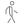                                             | `<WalkOutlineIcon />`                     |
|                                          | `<WalletIcon />`                   |                                          | `<WalletOutlineIcon />`                   |
|                                        | `<WarningIcon />`                  |                                        | `<WarningOutlineIcon />`                  |
|                                            | `<WatchIcon />`                    |                                            | `<WatchOutlineIcon />`                    |
|                                            | `<WaterIcon />`                    |                                            | `<WaterOutlineIcon />`                    |
|                                              | `<WifiIcon />`                     |                                              | `<WifiOutlineIcon />`                     |
|                                              | `<WineIcon />`                     |                                              | `<WineOutlineIcon />`                     |
|                                            | `<WomanIcon />`                    |                                            | `<WomanOutlineIcon />`                    |
|                                | `<LogoAlipayIcon />`               |                                                                                       |
|                                | `<LogoAmazonIcon />`               |                                                                                       |
|                              | `<LogoAmplifyIcon />`              |                                                                                       |
|                              | `<LogoAndroidIcon />`              |                                                                                       |
|                              | `<LogoAngularIcon />`              |                                                                                       |
|                | `<LogoAppleAppstoreIcon />`        |                                                                                       |
|                                  | `<LogoAppleIcon />`                |                                                                                       |
|                              | `<LogoBehanceIcon />`              |                                                                                       |
|                          | `<LogoBitbucketIcon />`            |                                                                                       |
|                              | `<LogoBitcoinIcon />`              |                                                                                       |
|                                | `<LogoBufferIcon />`               |                                                                                       |
|                          | `<LogoCapacitorIcon />`            |                                                                                       |
|                                | `<LogoChromeIcon />`               |                                                                                       |
|          | `<LogoClosedCaptioningIcon />`     |                                                                                       |
|                              | `<LogoCodepenIcon />`              |                                                                                       |
|                                    | `<LogoCss3Icon />`                 |                                                                                       |
|                    | `<LogoDesignernewsIcon />`         |                                                                                       |
|                        | `<LogoDeviantartIcon />`           |                                                                                       |
|                              | `<LogoDiscordIcon />`              |                                                                                       |
|                                | `<LogoDockerIcon />`               |                                                                                       |
|                            | `<LogoDribbbleIcon />`             |                                                                                       |
|                              | `<LogoDropboxIcon />`              |                                                                                       |
|                                    | `<LogoEdgeIcon />`                 |                                                                                       |
|                            | `<LogoElectronIcon />`             |                                                                                       |
|                                    | `<LogoEuroIcon />`                 |                                                                                       |
|                            | `<LogoFacebookIcon />`             |                                                                                       |
|                                  | `<LogoFigmaIcon />`                |                                                                                       |
|                            | `<LogoFirebaseIcon />`             |                                                                                       |
|                              | `<LogoFirefoxIcon />`              |                                                                                       |
|                                | `<LogoFlickrIcon />`               |                                                                                       |
|                        | `<LogoFoursquareIcon />`           |                                                                                       |
|                                | `<LogoGithubIcon />`               |                                                                                       |
|                                | `<LogoGitlabIcon />`               |                                                                                       |
|                                | `<LogoGoogleIcon />`               |                                                                                       |
|            | `<LogoGooglePlaystoreIcon />`      |                                                                                       |
|                        | `<LogoHackernewsIcon />`           |                                                                                       |
|                                  | `<LogoHtml5Icon />`                |                                                                                       |
|                          | `<LogoInstagramIcon />`            |                                                                                       |
|                                  | `<LogoIonicIcon />`                |                                                                                       |
|                            | `<LogoIonitronIcon />`             |                                                                                       |
|                        | `<LogoJavascriptIcon />`           |                                                                                       |
|                              | `<LogoLaravelIcon />`              |                                                                                       |
|                            | `<LogoLinkedinIcon />`             |                                                                                       |
|                            | `<LogoMarkdownIcon />`             |                                                                                       |
|                            | `<LogoMastodonIcon />`             |                                                                                       |
|                                | `<LogoMediumIcon />`               |                                                                                       |
|                        | `<LogoNoSmokingIcon />`            |                                                                                       |
|                                | `<LogoNodejsIcon />`               |                                                                                       |
|                                      | `<LogoNpmIcon />`                  |                                                                                       |
|                              | `<LogoOctocatIcon />`              |                                                                                       |
|                                | `<LogoPaypalIcon />`               |                                                                                       |
|                          | `<LogoPinterestIcon />`            |                                                                                       |
|                      | `<LogoPlaystationIcon />`          |                                                                                       |
|                                      | `<LogoPwaIcon />`                  |                                                                                       |
|                                | `<LogoPythonIcon />`               |                                                                                       |
|                                  | `<LogoReactIcon />`                |                                                                                       |
|                                | `<LogoRedditIcon />`               |                                                                                       |
|                                      | `<LogoRssIcon />`                  |                                                                                       |
|                                    | `<LogoSassIcon />`                 |                                                                                       |
|                                  | `<LogoSkypeIcon />`                |                                                                                       |
|                                  | `<LogoSlackIcon />`                |                                                                                       |
|                            | `<LogoSnapchatIcon />`             |                                                                                       |
|                        | `<LogoSoundcloudIcon />`           |                                                                                       |
|                  | `<LogoStackoverflowIcon />`        |                                                                                       |
|                                  | `<LogoSteamIcon />`                |                                                                                       |
|                              | `<LogoStencilIcon />`              |                                                                                       |
| 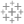                             | `<LogoTableauIcon />`              |                                                                                       |
|                                | `<LogoTiktokIcon />`               |                                                                                       |
|                                | `<LogoTumblrIcon />`               |                                                                                       |
|                                      | `<LogoTuxIcon />`                  |                                                                                       |
|                                | `<LogoTwitchIcon />`               |                                                                                       |
|                              | `<LogoTwitterIcon />`              |                                                                                       |
|                                      | `<LogoUsdIcon />`                  |                                                                                       |
|                                  | `<LogoVenmoIcon />`                |                                                                                       |
|                                | `<LogoVercelIcon />`               |                                                                                       |
|                                  | `<LogoVimeoIcon />`                |                                                                                       |
|                                        | `<LogoVkIcon />`                   |                                                                                       |
|                                      | `<LogoVueIcon />`                  |                                                                                       |
|                  | `<LogoWebComponentIcon />`         |                                                                                       |
|                                | `<LogoWechatIcon />`               |                                                                                       |
|                            | `<LogoWhatsappIcon />`             |                                                                                       |
|                              | `<LogoWindowsIcon />`              |                                                                                       |
|                          | `<LogoWordpressIcon />`            |                                                                                       |
|                                    | `<LogoXboxIcon />`                 |                                                                                       |
|                                    | `<LogoXingIcon />`                 |                                                                                       |
|                                  | `<LogoYahooIcon />`                |                                                                                       |
|                                      | `<LogoYenIcon />`                  |                                                                                       |
|                              | `<LogoYoutubeIcon />`              |                                                                                       |

## Automatic Release

Here is an example of the release type that will be done based on a commit messages:

| Commit message      | Release type          |
| ------------------- | --------------------- |
| fix: [comment]      | Patch Release         |
| feat: [comment]     | Minor Feature Release |
| perf: [comment]     | Major Feature Release |
| doc: [comment]      | No Release            |
| refactor: [comment] | No Release            |
| chore: [comment]    | No Release            |
